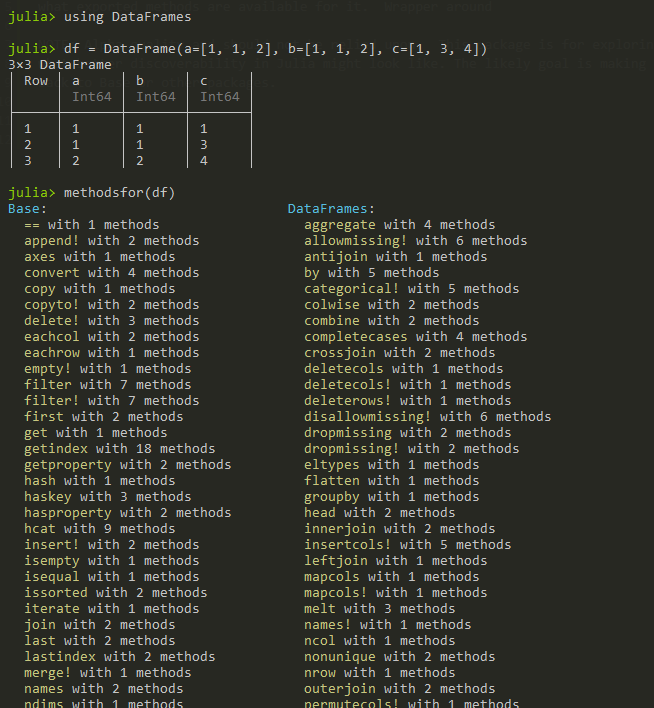

# MethodsFor

Exports a single function `methodsfor` which takes a type or val and pretty prints
what exported methods are available for it.  Wrapper around Base (`methodswith`)[https://docs.julialang.org/en/v1/stdlib/InteractiveUtils/#InteractiveUtils.methodswith]

Example usage

NOTE: Alpha quality and should not be relied upon.  This package is for exploring
what better discoverability in Julia might look like. The likely goal is making changes
back to Base or other packages.